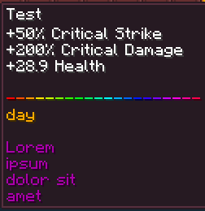

Dynamic Lore Generation refers to generating lore with mythic automatically, parsing placeholders and using templates.

Here is an example item using these features. The details to make something like this yourself is explained in the following documentation.



## Lore Templates

The base Mythic folder or individual pack folder can contain a `lore-templates.yml` file where lore templates are defined.

Here is an example of a `lore-templates.yml` file.
```yml
BasicWeaponTest:
     Lines:
     - '<white><lore.stats>'
     - ''
     - '<placeholder.TestLine>'
     - '<gold><placeholder.TestConditionalPlaceholder>'
     - ''
     - '<lore.Description{wrap=10}>'
```
An item could utilize this template by using `Lore.Template: BasicWeaponTest ` instead of providing a list of lore:

```yml
TestLoreTemplates1:
  Id: BLAZE_ROD
  Display: 'Test'
  Lore:
    Template: BasicWeaponTest
    Description: Lorem ipsum dolor sit amet
  Stats:
  - CRITICAL_STRIKE_CHANCE 0.5 ADDITIVE
  - CRITICAL_STRIKE_DAMAGE 2.0 ADDITIVE
  - HEALTH 20to30 ADDITIVE
```
Note that `Description` is used as a placeholder in the `BasicWeaponTest`'s `<lore.Description{wrap=10}>` placeholder. You can define arbitrary lore placeholders and use them the same way as this.

## Lore Placeholders

The `<placeholder.*>` placeholders in the above example are referencing the examples provided from the new [`placeholders.yml`](TODO:LINK), which can also be used.


## Other Information about Lore Templates

- Every node under Lore other than `Template` will be passed to the template as a `<lore.*>` placeholder (where `*` is the node you specify.)

- Templates can use any other applicable placeholders supported by drop tables.

- A line with `<lore.stats>` will be iterated and replicated for each stat using the tooltip formats configured in [`stats.yml`](TODO:LINK).

- More features for this are planned as well.

## Lore Attributes

Attributes are formatted similarly to how skills are. In our previous example, `wrap` is considered an Attribute.

```yml
<lore.node{attribute=value}>
```

| Attribute      | Aliases     | Description                                                            | Default |
|----------------|-------------|------------------------------------------------------------------------|---------|
| wrap           |             | How many characters are displayed before wrapping text to the next line| N/A     |