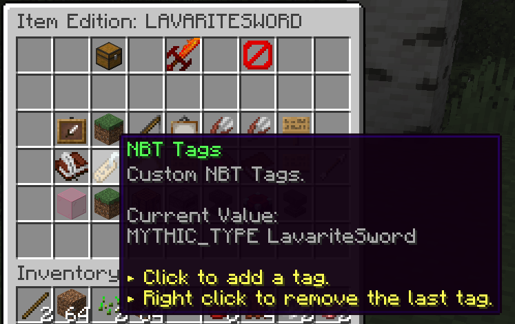

Crucible can act as a bridge to allow MythicMobs skills to be used with MMOItems as well (or theoretically any compatible item-generating plugin).

Once Crucible is installed, you can add skills to an MMOItem by doing the following:

## Create a "Dummy Item" in MythicMobs that contains the skills you want
```
LavariteSword:
  Id: STICK   # doesn't matter since it's a dummy item
  Skills:
  - skill{s=[
        - effect:particleline{p=flame;amount=5;speed=0.1;yOffset=0.45;hO=0.5;vO=0.5}
        - damage{amount=10;element=FIRE}
        - ignite{ticks=100}
    ]} @target ~onUse
```
None of the settings on the item matter, because it's just a dummy item there to act as an anchor for the skills.

## Add a special NBT tag to your MMOItem
Once you've created your dummy MythicMobs item, you just have to go add the appropriate NBT tag to your MMOItem.
- Edit your MMOItem
- Click **NBT Tags** to add an NBT tag
- Enter: **MYTHIC_TYPE [dummy_item_name]**
- That's it!



After you add the NBT tag to your MMOItem, the MMOItem will act as though it has the same skills as the dummy item you created.